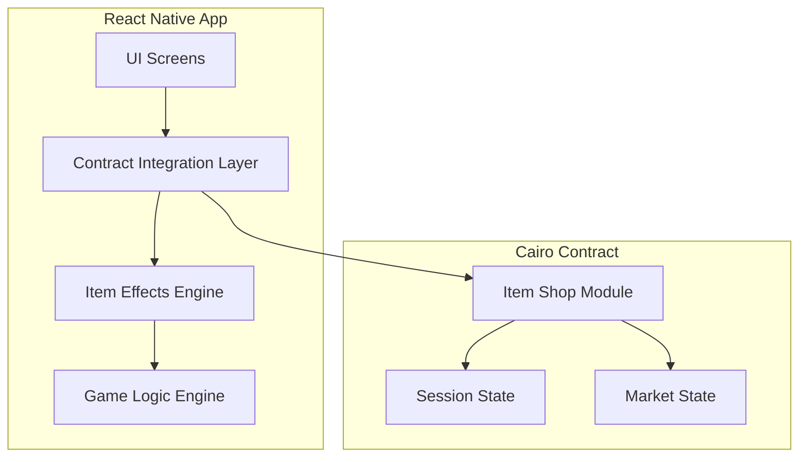
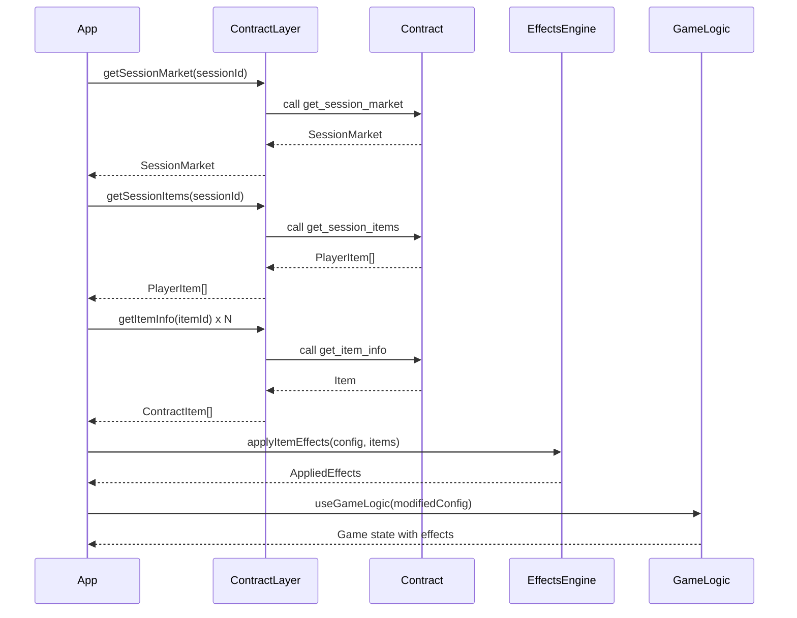

# Design Document

## Overview

This design implements a complete item shop system for the Abyss slot machine game, integrating Cairo smart contract functionality with the React Native mobile app. The system allows players to purchase items that modify gameplay mechanics, creating a roguelike progression experience.

The architecture follows a client-side effect application pattern where the contract stores item ownership and market state, while the mobile app reads this data and applies effects during gameplay. This approach simplifies implementation while maintaining data integrity through on-chain storage.

## Architecture

### High-Level Flow



### Component Relationships

1. **Contract Integration Layer** (`utils/abyssContract.ts`)
   - Wraps Aegis SDK calls to contract methods
   - Handles serialization/deserialization of contract data
   - Provides typed interfaces for item shop operations

2. **Item Effects Engine** (new: `utils/itemEffects.ts`)
   - Reads owned items from contract
   - Applies effect transformations to game config
   - Calculates modified symbol scores, probabilities, multipliers

3. **UI Screens**
   - Market Screen (`app/market.tsx`) - Browse and purchase items
   - Inventory Screen (`app/inventory.tsx`) - View owned items, sell items
   - Game Screen (modified `app/game.tsx`) - Access market/inventory, display active effects

4. **Game Logic Integration** (modified `hooks/useGameLogic.ts`)
   - Fetches inventory at session start
   - Applies item effects to game configuration
   - Recalculates on inventory changes

## Components and Interfaces

### 1. Contract Integration Layer

**File:** `utils/abyssContract.ts` (extend existing)

```typescript
// Item types matching Cairo contract
export enum ItemEffectType {
  ScoreMultiplier = 0,
  PatternMultiplierBoost = 1,
  SymbolProbabilityBoost = 2,
  DirectScoreBonus = 3,
  SpinBonus = 4,
  LevelProgressionBonus = 5,
}

export interface ContractItem {
  item_id: number;
  name: string;
  description: string;
  price: number;
  sell_price: number;
  effect_type: ItemEffectType;
  effect_value: number;
  target_symbol: string;
}

export interface SessionMarket {
  refresh_count: number;
  item_slot_1: number;
  item_slot_2: number;
  item_slot_3: number;
  item_slot_4: number;
  item_slot_5: number;
  item_slot_6: number;
}

export interface PlayerItem {
  item_id: number;
  quantity: number;
}

// New contract wrapper functions
export async function getSessionMarket(sessionId: number): Promise<SessionMarket>;
export async function getSessionItems(sessionId: number): Promise<PlayerItem[]>;
export async function getItemInfo(itemId: number): Promise<ContractItem>;
export async function buyItemFromMarket(sessionId: number, marketSlot: number): Promise<string>;
export async function sellItem(sessionId: number, itemId: number, quantity: number): Promise<string>;
export async function refreshMarket(sessionId: number): Promise<string>;
export async function getSessionInventoryCount(sessionId: number): Promise<number>;
```

**Rationale:** Extends existing contract integration pattern. Uses Aegis SDK for all contract interactions. Maps contract structs to TypeScript interfaces for type safety.

### 2. Item Effects Engine

**File:** `utils/itemEffects.ts` (new)

```typescript
import { GameConfig, SymbolConfig, PatternMultiplier } from '@/constants/GameConfig';
import { ContractItem, ItemEffectType } from './abyssContract';

export interface AppliedEffects {
  modifiedConfig: GameConfig;
  activeEffects: EffectSummary[];
}

export interface EffectSummary {
  itemId: number;
  itemName: string;
  effectType: ItemEffectType;
  effectValue: number;
  targetSymbol?: string;
  description: string;
}

/**
 * Apply item effects to base game configuration
 * Implements Requirement 7: Client-Side Item Effects Application
 */
export function applyItemEffects(
  baseConfig: GameConfig,
  ownedItems: ContractItem[]
): AppliedEffects {
  let modifiedConfig = JSON.parse(JSON.stringify(baseConfig)); // Deep copy
  const activeEffects: EffectSummary[] = [];

  // Apply DirectScoreBonus effects
  ownedItems
    .filter(item => item.effect_type === ItemEffectType.DirectScoreBonus)
    .forEach(item => {
      const symbolConfig = modifiedConfig.symbols.find(
        s => s.type === item.target_symbol
      );
      if (symbolConfig) {
        symbolConfig.points += item.effect_value;
        activeEffects.push(createEffectSummary(item));
      }
    });

  // Apply SymbolProbabilityBoost effects
  ownedItems
    .filter(item => item.effect_type === ItemEffectType.SymbolProbabilityBoost)
    .forEach(item => {
      const symbolConfig = modifiedConfig.symbols.find(
        s => s.type === item.target_symbol
      );
      if (symbolConfig) {
        symbolConfig.probability += item.effect_value;
        activeEffects.push(createEffectSummary(item));
      }
    });

  // Normalize probabilities to sum to 100
  normalizeProbabilities(modifiedConfig.symbols);

  // Apply PatternMultiplierBoost effects (stack additively)
  const patternBoostTotal = ownedItems
    .filter(item => item.effect_type === ItemEffectType.PatternMultiplierBoost)
    .reduce((sum, item) => {
      activeEffects.push(createEffectSummary(item));
      return sum + item.effect_value;
    }, 0);

  modifiedConfig.patternMultipliers = modifiedConfig.patternMultipliers.map(pm => ({
    ...pm,
    multiplier: pm.multiplier * (100 + patternBoostTotal) / 100
  }));

  return { modifiedConfig, activeEffects };
}

/**
 * Calculate additional spins from SpinBonus items
 */
export function calculateBonusSpins(ownedItems: ContractItem[]): number {
  return ownedItems
    .filter(item => item.effect_type === ItemEffectType.SpinBonus)
    .reduce((sum, item) => sum + item.effect_value, 0);
}

/**
 * Calculate score multiplier from ScoreMultiplier items
 */
export function calculateScoreMultiplier(ownedItems: ContractItem[]): number {
  const multiplierBonus = ownedItems
    .filter(item => item.effect_type === ItemEffectType.ScoreMultiplier)
    .reduce((sum, item) => sum + item.effect_value, 0);

  return (100 + multiplierBonus) / 100; // Convert percentage to decimal
}

/**
 * Calculate level progression reduction from LevelProgressionBonus items
 */
export function calculateLevelProgressionBonus(ownedItems: ContractItem[]): number {
  return ownedItems
    .filter(item => item.effect_type === ItemEffectType.LevelProgressionBonus)
    .reduce((sum, item) => sum + item.effect_value, 0);
}

function normalizeProbabilities(symbols: SymbolConfig[]): void {
  const total = symbols.reduce((sum, s) => sum + s.probability, 0);
  if (total !== 100) {
    const factor = 100 / total;
    symbols.forEach(s => s.probability = Math.round(s.probability * factor));
  }
}

function createEffectSummary(item: ContractItem): EffectSummary {
  return {
    itemId: item.item_id,
    itemName: item.name,
    effectType: item.effect_type,
    effectValue: item.effect_value,
    targetSymbol: item.target_symbol || undefined,
    description: item.description,
  };
}
```

**Rationale:** Centralizes all effect calculation logic. Pure functions for testability. Returns both modified config and summary for UI display. Handles probability normalization to maintain valid game state.

### 3. Market Screen

**File:** `app/market.tsx` (new)

```typescript
import { View, Text, StyleSheet, Pressable, ScrollView, Image, ImageBackground, ActivityIndicator, Alert } from 'react-native';
import { useLocalSearchParams, useRouter } from 'expo-router';
import { SafeAreaView } from 'react-native-safe-area-context';
import { useState, useEffect } from 'react';
import Animated, { FadeIn } from 'react-native-reanimated';
import { Ionicons } from '@expo/vector-icons';
import { Theme } from '../constants/Theme';
import {
  getSessionMarket,
  getItemInfo,
  buyItemFromMarket,
  refreshMarket,
  getSessionData,
  getSessionInventoryCount,
  ContractItem,
  SessionMarket as SessionMarketType,
} from '../utils/abyssContract';

interface MarketScreenParams {
  sessionId: string;
}

export default function MarketScreen() {
  const { sessionId } = useLocalSearchParams<MarketScreenParams>();
  const router = useRouter();
  const parsedSessionId = parseInt(sessionId || '0', 10);

  const [loading, setLoading] = useState(true);
  const [marketData, setMarketData] = useState<SessionMarketType | null>(null);
  const [marketItems, setMarketItems] = useState<ContractItem[]>([]);
  const [ownedItemIds, setOwnedItemIds] = useState<Set<number>>(new Set());
  const [balance, setBalance] = useState(0);
  const [inventoryCount, setInventoryCount] = useState(0);
  const [refreshing, setRefreshing] = useState(false);

  useEffect(() => {
    loadMarketData();
  }, [sessionId]);

  async function loadMarketData() {
    try {
      setLoading(true);

      // Fetch session data for balance
      const sessionData = await getSessionData(parsedSessionId);
      setBalance(sessionData.score);

      // Fetch market data
      const market = await getSessionMarket(parsedSessionId);
      setMarketData(market);

      // Fetch item details for each market slot
      const itemIds = [
        market.item_slot_1,
        market.item_slot_2,
        market.item_slot_3,
        market.item_slot_4,
        market.item_slot_5,
        market.item_slot_6,
      ];

      const items = await Promise.all(
        itemIds.map(id => getItemInfo(id))
      );
      setMarketItems(items);

      // Fetch inventory to check owned items
      const invCount = await getSessionInventoryCount(parsedSessionId);
      setInventoryCount(invCount);

      // Note: We'll need to fetch owned item IDs to mark them in UI
      // This requires calling get_session_items and mapping to IDs

    } catch (error) {
      console.error('Failed to load market:', error);
      Alert.alert('Error', 'Failed to load market data');
    } finally {
      setLoading(false);
    }
  }

  async function handleBuyItem(marketSlot: number, item: ContractItem) {
    // Show confirmation modal
    Alert.alert(
      'Purchase Item',
      `${item.name}\n${item.description}\n\nCost: ${item.price} points`,
      [
        { text: 'Cancel', style: 'cancel' },
        {
          text: 'Buy',
          onPress: async () => {
            try {
              await buyItemFromMarket(parsedSessionId, marketSlot);
              Alert.alert('Success', 'Item purchased!');
              await loadMarketData(); // Refresh
            } catch (error: any) {
              if (error.message?.includes('already owned')) {
                Alert.alert('Error', 'Item already owned');
              } else if (error.message?.includes('Inventory full')) {
                Alert.alert('Error', 'Inventory full (max 6 items)');
              } else if (error.message?.includes('Insufficient score')) {
                Alert.alert('Error', 'Not enough balance');
              } else {
                Alert.alert('Error', 'Purchase failed');
              }
            }
          }
        }
      ]
    );
  }

  async function handleRefreshMarket() {
    // Implementation for refresh with cost check
  }

  // Render market item cards, handle owned/disabled states
  // Show balance, inventory count (X/6)
  // Navigation back button
}
```

**Rationale:** Implements Requirements 2, 3, 6. Uses Expo Router params for session context. Follows existing screen patterns (SafeAreaView, ImageBackground, Theme). Shows 6 item cards with images from `app/assets/images/item{id}.png`. Handles purchase flow with confirmation modal and error states.

### 4. Inventory Screen

**File:** `app/inventory.tsx` (new)

```typescript
import { View, Text, StyleSheet, Pressable, ScrollView, Image, ImageBackground, ActivityIndicator, Alert } from 'react-native';
import { useLocalSearchParams, useRouter } from 'expo-router';
import { SafeAreaView } from 'react-native-safe-area-context';
import { useState, useEffect } from 'react';
import Animated, { FadeIn } from 'react-native-reanimated';
import { Ionicons } from '@expo/vector-icons';
import { Theme } from '../constants/Theme';
import {
  getSessionItems,
  getItemInfo,
  sellItem,
  getSessionData,
  ContractItem,
  PlayerItem,
} from '../utils/abyssContract';

interface InventoryScreenParams {
  sessionId: string;
}

export default function InventoryScreen() {
  const { sessionId } = useLocalSearchParams<InventoryScreenParams>();
  const router = useRouter();
  const parsedSessionId = parseInt(sessionId || '0', 10);

  const [loading, setLoading] = useState(true);
  const [ownedItems, setOwnedItems] = useState<ContractItem[]>([]);
  const [balance, setBalance] = useState(0);

  useEffect(() => {
    loadInventory();
  }, [sessionId]);

  async function loadInventory() {
    try {
      setLoading(true);

      // Fetch session data for balance
      const sessionData = await getSessionData(parsedSessionId);
      setBalance(sessionData.score);

      // Fetch owned items
      const playerItems = await getSessionItems(parsedSessionId);

      // Fetch full item details
      const items = await Promise.all(
        playerItems.map(pi => getItemInfo(pi.item_id))
      );
      setOwnedItems(items);

    } catch (error) {
      console.error('Failed to load inventory:', error);
      Alert.alert('Error', 'Failed to load inventory');
    } finally {
      setLoading(false);
    }
  }

  async function handleSellItem(item: ContractItem) {
    Alert.alert(
      'Sell Item',
      `${item.name}\n\nSell for: ${item.sell_price} points`,
      [
        { text: 'Cancel', style: 'cancel' },
        {
          text: 'Sell',
          style: 'destructive',
          onPress: async () => {
            try {
              await sellItem(parsedSessionId, item.item_id, 1);
              Alert.alert('Success', `Sold for ${item.sell_price} points`);
              await loadInventory(); // Refresh
            } catch (error) {
              Alert.alert('Error', 'Failed to sell item');
            }
          }
        }
      ]
    );
  }

  // Render owned item cards with sell option
  // Show empty state if no items
  // Display item count (X/6)
  // Show effect details for each item
}
```

**Rationale:** Implements Requirements 4, 5. Displays owned items with visual representation. Allows selling with confirmation. Shows effect details to help player understand their active bonuses.

### 5. Game Screen Integration

**File:** `app/game.tsx` (modifications)

```typescript
// Add state for inventory
const [ownedItems, setOwnedItems] = useState<ContractItem[]>([]);
const [appliedEffects, setAppliedEffects] = useState<AppliedEffects | null>(null);

// Load inventory and apply effects on mount
useEffect(() => {
  async function loadInventoryAndApplyEffects() {
    try {
      const playerItems = await getSessionItems(parsedSessionId);
      const items = await Promise.all(
        playerItems.map(pi => getItemInfo(pi.item_id))
      );
      setOwnedItems(items);

      // Apply effects to game config
      const effects = applyItemEffects(DEFAULT_GAME_CONFIG, items);
      setAppliedEffects(effects);

      // Update game logic with modified config
      // This will require modifying useGameLogic to accept dynamic config
    } catch (error) {
      console.error('Failed to load inventory:', error);
    }
  }

  if (sessionDataLoaded) {
    loadInventoryAndApplyEffects();
  }
}, [sessionDataLoaded]);

// Add Market and Inventory buttons to UI
// Position them near existing UI elements (settings, etc.)
// Reload effects when returning from market/inventory screens
```

**Rationale:** Implements Requirement 8. Integrates item effects into existing game flow. Buttons provide access to shop features without disrupting gameplay. Effects reload when inventory changes.

### 6. Game Logic Hook Modifications

**File:** `hooks/useGameLogic.ts` (modifications)

```typescript
// Accept dynamic game config instead of using DEFAULT_GAME_CONFIG directly
export function useGameLogic(
  initialScore: number,
  initialSpins: number,
  sessionId: number,
  gameConfig: GameConfig, // Now passed in with item effects applied
  onPatternsDetected: (patterns: Pattern[]) => void
) {
  // Use gameConfig instead of DEFAULT_GAME_CONFIG for all calculations
  // Apply score multiplier from items when calculating final scores
  // Add bonus spins from items to initial spins
}
```

**Rationale:** Allows item effects to modify game behavior. Maintains separation of concerns - hook doesn't know about items, just receives modified config.

## Data Models

### Contract Data Flow



### State Management

Each screen manages its own state independently:

**Market Screen State:**
- `marketData: SessionMarket | null` - Raw market data from contract
- `marketItems: ContractItem[]` - Full item details for 6 market slots
- `ownedItemIds: Set<number>` - Set of owned item IDs for quick lookup
- `balance: number` - Current session score/balance
- `inventoryCount: number` - Current inventory size (0-6)
- `loading: boolean` - Initial load state
- `refreshing: boolean` - Refresh operation state

**Inventory Screen State:**
- `ownedItems: ContractItem[]` - Full details of owned items
- `balance: number` - Current session score/balance
- `loading: boolean` - Load state

**Game Screen Additions:**
- `ownedItems: ContractItem[]` - Cached owned items
- `appliedEffects: AppliedEffects | null` - Computed effect modifications

**Rationale:** Each screen is self-contained, fetches its own data. Game screen caches inventory to avoid re-fetching on every render. Effects are computed once and cached until inventory changes.

## Error Handling

### Contract Call Failures

**Strategy:** Retry with exponential backoff, then fallback to cached data or error state.

```typescript
async function retryContractCall<T>(
  fn: () => Promise<T>,
  maxRetries: number = 3
): Promise<T> {
  for (let i = 0; i < maxRetries; i++) {
    try {
      return await fn();
    } catch (error) {
      if (i === maxRetries - 1) throw error;
      await new Promise(resolve => setTimeout(resolve, 1000 * Math.pow(2, i)));
    }
  }
  throw new Error('Max retries exceeded');
}
```

### Transaction Failures

**Purchase/Sell Errors:**
- Insufficient balance → Display specific error message
- Item already owned → Display specific error message
- Inventory full → Display specific error message
- Network error → Show retry button
- Unknown error → Generic error message with option to retry

**Implementation:**
```typescript
catch (error: any) {
  // Parse contract revert messages
  const message = error.message || '';

  if (message.includes('already owned')) {
    Alert.alert('Error', 'Item already owned');
  } else if (message.includes('Inventory full')) {
    Alert.alert('Error', 'Inventory full (max 6 items)');
  } else if (message.includes('Insufficient')) {
    Alert.alert('Error', 'Not enough balance');
  } else {
    Alert.alert('Error', 'Transaction failed', [
      { text: 'Retry', onPress: () => retryOperation() },
      { text: 'Cancel', style: 'cancel' }
    ]);
  }
}
```

### State Synchronization

**Problem:** App state may become out of sync with contract state if transaction succeeds but UI update fails.

**Solution:** Always refresh data from contract after successful transactions. Implement optimistic updates with rollback on failure.

```typescript
async function buyItemWithOptimisticUpdate(
  sessionId: number,
  marketSlot: number,
  item: ContractItem
) {
  // Save current state
  const previousState = {
    balance,
    inventoryCount,
    ownedItems: [...ownedItems]
  };

  // Optimistic update
  setBalance(prev => prev - item.price);
  setInventoryCount(prev => prev + 1);
  setOwnedItems(prev => [...prev, item]);

  try {
    await buyItemFromMarket(sessionId, marketSlot);
    // Success - refresh to confirm
    await loadMarketData();
  } catch (error) {
    // Rollback on error
    setBalance(previousState.balance);
    setInventoryCount(previousState.inventoryCount);
    setOwnedItems(previousState.ownedItems);
    throw error;
  }
}
```

### Edge Cases

1. **Session expiration during shop access**
   - Check session validity before operations
   - Redirect to session selection if invalid

2. **Rapid clicking / Double purchases**
   - Disable buy button during transaction
   - Use debouncing on button press

3. **Invalid item images**
   - Provide fallback image if `item{id}.png` not found
   - Log warning for missing assets

4. **Probability normalization edge cases**
   - Ensure probabilities always sum to 100 after item effects
   - Round to nearest integer, adjust largest value if needed

## UI/UX Considerations

### Visual Design

**Market Screen:**
- 3x2 grid of item cards
- Each card: Image (120x120), name, description, price
- Visual states: Available, Owned (grayed + badge), Insufficient Balance (dimmed)
- Header: Balance display, Inventory count (X/6), Refresh button

**Inventory Screen:**
- Vertical scrollable list of owned items
- Each card: Image (100x100), name, description, effect summary, sell price
- Empty state: Large icon + "No items owned" message
- Header: Balance display, Item count (X/6)

**Game Screen Additions:**
- Floating buttons: Market icon, Inventory icon
- Position: Near existing settings button
- Active effects indicator: Small badge showing count of active items

### Animations

**Purchase Success:**
- Item card scales up and fades out
- Balance number counts down smoothly
- Success checkmark animation

**Sell Success:**
- Item card slides out
- Balance number counts up smoothly
- Coins animation

**Item Cards:**
- Hover/press: Scale to 1.05, shadow increase
- Transition: 200ms ease-out

### Accessibility

- All interactive elements have minimum 44pt touch target
- Balance and inventory count have high contrast
- Error messages use clear, non-technical language
- Loading states show spinner with descriptive text

## Implementation Phases

The implementation will be broken into incremental phases to ensure each part works before moving forward:

**Phase 1: Contract Integration**
- Extend `abyssContract.ts` with item shop functions
- Add TypeScript interfaces matching contract structs
- Test all contract calls in isolation

**Phase 2: Item Effects Engine**
- Create `itemEffects.ts` with pure calculation functions
- Unit test all effect types
- Verify probability normalization

**Phase 3: Market Screen**
- Create market UI with static data
- Integrate contract data fetching
- Implement purchase flow
- Add error handling

**Phase 4: Inventory Screen**
- Create inventory UI
- Integrate contract data fetching
- Implement sell flow

**Phase 5: Game Integration**
- Add market/inventory navigation to game screen
- Load and apply item effects in game logic
- Test effect application on gameplay

**Phase 6: Polish**
- Add animations
- Refine error messages
- Visual feedback improvements

Each phase references specific requirements and can be implemented and tested independently.
