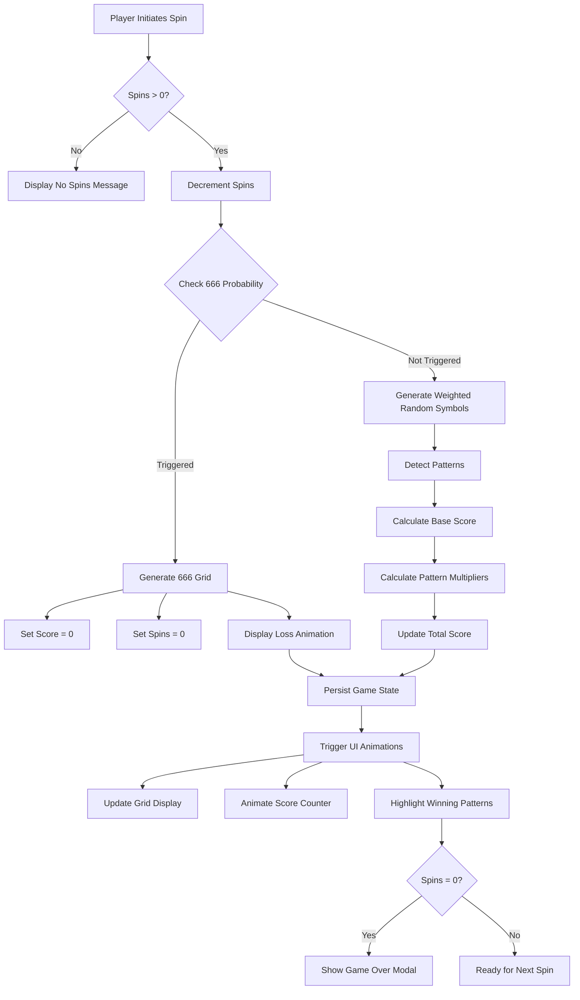
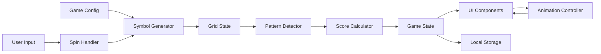

# Design Document - Slot Game Logic

## Overview

The slot game logic system implements a probability-based gambling game engine for the Abyss mobile application. The architecture separates game logic from UI rendering through a clean state management pattern, using React hooks for local state and designed for future blockchain integration.

The core engine consists of five main subsystems: **Symbol Generator** (weighted random selection), **Pattern Detector** (win condition matching), **Score Calculator** (points and multipliers), **Game State Manager** (orchestration), and **Animation Controller** (visual feedback). The system processes each spin through a deterministic pipeline: 666 check → symbol generation → pattern detection → score calculation → state update → UI animation.

The design prioritizes performance (< 50ms for calculations), testability (pure functions for core logic), and extensibility (configuration-driven parameters). All game logic is implemented as pure TypeScript functions, making it easy to test and later migrate to smart contract equivalents.

## Architecture



### Data Flow Architecture



## Components and Interfaces

### 1. Game Configuration (`constants/GameConfig.ts`)

**Purpose**: Centralized configuration for all game parameters, probabilities, and values.

**Interface**:
```typescript
export interface SymbolConfig {
  type: SymbolType;
  points: number;
  probability: number; // 0-100
}

export interface PatternMultiplier {
  type: 'horizontal-3' | 'horizontal-4' | 'horizontal-5' | 'vertical-3' | 'diagonal-3';
  multiplier: number;
}

export interface GameConfig {
  symbols: SymbolConfig[];
  patternMultipliers: PatternMultiplier[];
  probability666: number; // 0-100
  animationDurations: {
    spin: number;
    reveal: number;
    scoreCount: number;
  };
}
```

**Implementation**:
```typescript
export const DEFAULT_GAME_CONFIG: GameConfig = {
  symbols: [
    { type: 'seven', points: 7, probability: 5 },
    { type: 'diamond', points: 5, probability: 10 },
    { type: 'cherry', points: 4, probability: 20 },
    { type: 'coin', points: 3, probability: 15 },
    { type: 'lemon', points: 2, probability: 25 },
    { type: 'six', points: 0, probability: 25 }, // Dangerous symbol - no points, contributes to 666
  ],
  patternMultipliers: [
    { type: 'horizontal-3', multiplier: 2 },
    { type: 'horizontal-4', multiplier: 5 },
    { type: 'horizontal-5', multiplier: 10 },
    { type: 'vertical-3', multiplier: 3 },
    { type: 'diagonal-3', multiplier: 4 },
  ],
  probability666: 1.5,
  animationDurations: {
    spin: 1500,
    reveal: 300,
    scoreCount: 800,
  },
};
```

**Rationale**: Configuration-driven design allows easy game balancing without code changes. References Requirements 1, 8.

---

### 2. Symbol Generator (`utils/symbolGenerator.ts`)

**Purpose**: Generates random symbols based on weighted probabilities.

**Interface**:
```typescript
export interface GenerateSymbolsResult {
  grid: SymbolType[][];
  is666: boolean;
}

export function generateSymbols(config: GameConfig): GenerateSymbolsResult;
export function check666Trigger(probability: number): boolean;
export function generateWeightedSymbol(symbolConfigs: SymbolConfig[]): SymbolType;
```

**Implementation**:
```typescript
export function generateSymbols(config: GameConfig): GenerateSymbolsResult {
  // First check 666
  const is666 = check666Trigger(config.probability666);

  if (is666) {
    return {
      grid: generate666Grid(),
      is666: true,
    };
  }

  // Generate normal weighted random grid
  const grid: SymbolType[][] = [];
  for (let row = 0; row < 3; row++) {
    grid[row] = [];
    for (let col = 0; col < 5; col++) {
      grid[row][col] = generateWeightedSymbol(config.symbols);
    }
  }

  return { grid, is666: false };
}

export function check666Trigger(probability: number): boolean {
  return Math.random() * 100 < probability;
}

export function generateWeightedSymbol(symbolConfigs: SymbolConfig[]): SymbolType {
  const totalWeight = symbolConfigs.reduce((sum, s) => sum + s.probability, 0);
  let random = Math.random() * totalWeight;

  for (const config of symbolConfigs) {
    random -= config.probability;
    if (random <= 0) {
      return config.type;
    }
  }

  // Fallback
  return symbolConfigs[0].type;
}

function generate666Grid(): SymbolType[][] {
  // Middle row gets three sixes
  return [
    [generateWeightedSymbol(DEFAULT_GAME_CONFIG.symbols), ...],
    ['six', 'six', 'six', ...],
    [generateWeightedSymbol(DEFAULT_GAME_CONFIG.symbols), ...],
  ];
}
```

**Rationale**: Pure functions make testing easy. Weighted random ensures fair probability distribution. References Requirements 2, 3.

---

### 3. Pattern Detector (`utils/patternDetector.ts`)

**Purpose**: Analyzes grid to find winning patterns.

**Interface**:
```typescript
export interface Pattern {
  type: 'horizontal-3' | 'horizontal-4' | 'horizontal-5' | 'vertical-3' | 'diagonal-3';
  positions: [number, number][]; // [row, col] pairs
  symbol: SymbolType;
  multiplier: number;
}

export function detectPatterns(
  grid: SymbolType[][],
  config: GameConfig
): Pattern[];

export function detectHorizontalPatterns(grid: SymbolType[][]): Pattern[];
export function detectVerticalPatterns(grid: SymbolType[][]): Pattern[];
export function detectDiagonalPatterns(grid: SymbolType[][]): Pattern[];
```

**Implementation**:
```typescript
export function detectPatterns(
  grid: SymbolType[][],
  config: GameConfig
): Pattern[] {
  const patterns: Pattern[] = [];

  patterns.push(...detectHorizontalPatterns(grid));
  patterns.push(...detectVerticalPatterns(grid));
  patterns.push(...detectDiagonalPatterns(grid));

  // Add multipliers from config
  return patterns.map(pattern => ({
    ...pattern,
    multiplier: getMultiplierForPattern(pattern.type, config),
  }));
}

export function detectHorizontalPatterns(grid: SymbolType[][]): Pattern[] {
  const patterns: Pattern[] = [];

  for (let row = 0; row < 3; row++) {
    // Check for 5-in-a-row
    if (grid[row].every(symbol => symbol === grid[row][0])) {
      patterns.push({
        type: 'horizontal-5',
        positions: grid[row].map((_, col) => [row, col] as [number, number]),
        symbol: grid[row][0],
        multiplier: 0, // Set later
      });
      continue;
    }

    // Check for 4-in-a-row
    for (let col = 0; col <= 1; col++) {
      const subset = grid[row].slice(col, col + 4);
      if (subset.every(symbol => symbol === subset[0])) {
        patterns.push({
          type: 'horizontal-4',
          positions: subset.map((_, i) => [row, col + i] as [number, number]),
          symbol: subset[0],
          multiplier: 0,
        });
      }
    }

    // Check for 3-in-a-row
    for (let col = 0; col <= 2; col++) {
      const subset = grid[row].slice(col, col + 3);
      if (subset.every(symbol => symbol === subset[0])) {
        patterns.push({
          type: 'horizontal-3',
          positions: subset.map((_, i) => [row, col + i] as [number, number]),
          symbol: subset[0],
          multiplier: 0,
        });
      }
    }
  }

  return patterns;
}

export function detectVerticalPatterns(grid: SymbolType[][]): Pattern[] {
  const patterns: Pattern[] = [];

  for (let col = 0; col < 5; col++) {
    const column = [grid[0][col], grid[1][col], grid[2][col]];
    if (column.every(symbol => symbol === column[0])) {
      patterns.push({
        type: 'vertical-3',
        positions: column.map((_, row) => [row, col] as [number, number]),
        symbol: column[0],
        multiplier: 0,
      });
    }
  }

  return patterns;
}

export function detectDiagonalPatterns(grid: SymbolType[][]): Pattern[] {
  const patterns: Pattern[] = [];

  // Top-left to bottom-right diagonals (limited by 3 rows)
  for (let startCol = 0; startCol <= 2; startCol++) {
    const diagonal = [
      grid[0][startCol],
      grid[1][startCol + 1],
      grid[2][startCol + 2],
    ];
    if (diagonal.every(symbol => symbol === diagonal[0])) {
      patterns.push({
        type: 'diagonal-3',
        positions: [
          [0, startCol],
          [1, startCol + 1],
          [2, startCol + 2],
        ],
        symbol: diagonal[0],
        multiplier: 0,
      });
    }
  }

  // Top-right to bottom-left diagonals
  for (let startCol = 2; startCol <= 4; startCol++) {
    const diagonal = [
      grid[0][startCol],
      grid[1][startCol - 1],
      grid[2][startCol - 2],
    ];
    if (diagonal.every(symbol => symbol === diagonal[0])) {
      patterns.push({
        type: 'diagonal-3',
        positions: [
          [0, startCol],
          [1, startCol - 1],
          [2, startCol - 2],
        ],
        symbol: diagonal[0],
        multiplier: 0,
      });
    }
  }

  return patterns;
}
```

**Rationale**: Separate detection functions for each pattern type enables unit testing. Pattern positions tracked for animation highlighting. References Requirement 4.

---

### 4. Score Calculator (`utils/scoreCalculator.ts`)

**Purpose**: Calculates points from symbols and pattern multipliers.

**Interface**:
```typescript
export interface ScoreBreakdown {
  baseScore: number;
  patternBonuses: {
    pattern: Pattern;
    bonus: number;
  }[];
  totalScore: number;
}

export function calculateScore(
  grid: SymbolType[][],
  patterns: Pattern[],
  config: GameConfig
): ScoreBreakdown;

export function calculateBaseScore(
  grid: SymbolType[][],
  config: GameConfig
): number;

export function calculatePatternBonus(
  pattern: Pattern,
  config: GameConfig
): number;
```

**Implementation**:
```typescript
export function calculateScore(
  grid: SymbolType[][],
  patterns: Pattern[],
  config: GameConfig
): ScoreBreakdown {
  const baseScore = calculateBaseScore(grid, config);

  const patternBonuses = patterns.map(pattern => ({
    pattern,
    bonus: calculatePatternBonus(pattern, config),
  }));

  const totalBonus = patternBonuses.reduce((sum, pb) => sum + pb.bonus, 0);

  return {
    baseScore,
    patternBonuses,
    totalScore: baseScore + totalBonus,
  };
}

export function calculateBaseScore(
  grid: SymbolType[][],
  config: GameConfig
): number {
  let total = 0;

  for (let row = 0; row < 3; row++) {
    for (let col = 0; col < 5; col++) {
      const symbol = grid[row][col];
      const symbolConfig = config.symbols.find(s => s.type === symbol);
      total += symbolConfig?.points || 0;
    }
  }

  return total;
}

export function calculatePatternBonus(
  pattern: Pattern,
  config: GameConfig
): number {
  const symbolConfig = config.symbols.find(s => s.type === pattern.symbol);
  if (!symbolConfig) return 0;

  const symbolValueInPattern = symbolConfig.points * pattern.positions.length;
  const bonus = symbolValueInPattern * (pattern.multiplier - 1); // Subtract 1 since base already counted

  return bonus;
}
```

**Rationale**: Breakdown structure provides transparency for UI display. Pattern bonuses calculated as multiplier minus base to avoid double-counting. References Requirement 5.

---

### 5. Game State Manager (`hooks/useGameLogic.ts`)

**Purpose**: Custom React hook orchestrating all game logic and state.

**Interface**:
```typescript
export interface GameLogicState {
  grid: SymbolType[][];
  score: number;
  spinsLeft: number;
  isSpinning: boolean;
  patterns: Pattern[];
  is666: boolean;
  gameOver: boolean;
  lastSpinScore: number;
}

export interface GameLogicActions {
  spin: () => void;
  reset: () => void;
}

export function useGameLogic(
  initialScore: number,
  initialSpins: number,
  config?: GameConfig
): [GameLogicState, GameLogicActions];
```

**Implementation**:
```typescript
export function useGameLogic(
  initialScore: number,
  initialSpins: number,
  config: GameConfig = DEFAULT_GAME_CONFIG
): [GameLogicState, GameLogicActions] {
  const [state, setState] = useState<GameLogicState>({
    grid: generateRandomGrid(),
    score: initialScore,
    spinsLeft: initialSpins,
    isSpinning: false,
    patterns: [],
    is666: false,
    gameOver: false,
    lastSpinScore: 0,
  });

  const spin = useCallback(() => {
    if (state.spinsLeft <= 0 || state.isSpinning || state.gameOver) {
      return;
    }

    setState(prev => ({ ...prev, isSpinning: true }));

    // Simulate spin animation delay
    setTimeout(() => {
      // Generate symbols
      const { grid, is666 } = generateSymbols(config);

      if (is666) {
        // 666 triggered - instant loss
        setState({
          grid,
          score: 0,
          spinsLeft: 0,
          isSpinning: false,
          patterns: [],
          is666: true,
          gameOver: true,
          lastSpinScore: 0,
        });

        // Persist game over state
        persistGameState({
          score: 0,
          spinsLeft: 0,
          isComplete: true,
          is666: true,
        });

        return;
      }

      // Normal spin
      const patterns = detectPatterns(grid, config);
      const scoreBreakdown = calculateScore(grid, patterns, config);

      const newScore = state.score + scoreBreakdown.totalScore;
      const newSpinsLeft = state.spinsLeft - 1;
      const isGameOver = newSpinsLeft <= 0;

      setState({
        grid,
        score: newScore,
        spinsLeft: newSpinsLeft,
        isSpinning: false,
        patterns,
        is666: false,
        gameOver: isGameOver,
        lastSpinScore: scoreBreakdown.totalScore,
      });

      // Persist state
      persistGameState({
        score: newScore,
        spinsLeft: newSpinsLeft,
        isComplete: isGameOver,
        is666: false,
      });

    }, config.animationDurations.spin);

  }, [state, config]);

  const reset = useCallback(() => {
    setState({
      grid: generateRandomGrid(),
      score: initialScore,
      spinsLeft: initialSpins,
      isSpinning: false,
      patterns: [],
      is666: false,
      gameOver: false,
      lastSpinScore: 0,
    });
  }, [initialScore, initialSpins]);

  return [state, { spin, reset }];
}
```

**Rationale**: Custom hook encapsulates all game logic in a reusable, testable package. Handles spin orchestration, state persistence, and 666 special case. References Requirements 3, 6, 9.

---

### 6. Animation Controller (`components/SpinAnimations.tsx`)

**Purpose**: Handles visual feedback and animations during gameplay.

**Interface**:
```typescript
export interface AnimationProps {
  isSpinning: boolean;
  patterns: Pattern[];
  grid: SymbolType[][];
  is666: boolean;
  onAnimationComplete?: () => void;
}

export function SpinAnimations(props: AnimationProps): JSX.Element;
export function useSpinAnimation(isSpinning: boolean): Animated.Value;
export function usePatternHighlight(patterns: Pattern[]): Map<string, Animated.Value>;
export function useScoreCountUp(targetScore: number, duration: number): number;
```

**Implementation Approach**:
- Use `react-native-reanimated` for 60fps animations
- Spinning symbols: blur + rotation effect
- Pattern highlighting: fade-in glow effect on winning symbols
- Score counting: animated number interpolation
- 666 animation: screen shake + red flash effect

**Rationale**: Separate animation logic from game logic for maintainability. Reanimated ensures native-thread 60fps performance. References Requirement 7.

---

## Data Models

### GameState Model
```typescript
interface PersistedGameState {
  sessionId: number;
  score: number;
  spinsLeft: number;
  isComplete: boolean;
  is666: boolean;
  timestamp: number;
}
```

**Storage**: AsyncStorage with key `game_state_${sessionId}`

---

### SpinResult Model
```typescript
interface SpinResult {
  grid: SymbolType[][];
  patterns: Pattern[];
  scoreBreakdown: ScoreBreakdown;
  is666: boolean;
  timestamp: number;
}
```

**Usage**: Represents outcome of a single spin for analytics/history

---

### GameOutcome Model
```typescript
interface GameOutcome {
  sessionId: number;
  finalScore: number;
  spinsUsed: number;
  totalPatternsMatched: number;
  bestPattern: Pattern | null;
  is666Loss: boolean;
  result: 'win' | 'loss' | 'total_loss';
}
```

**Usage**: Displayed in game over modal

---

## Error Handling

### Symbol Generation Errors
```typescript
try {
  const { grid, is666 } = generateSymbols(config);
} catch (error) {
  console.error('Symbol generation failed:', error);
  // Fallback to uniform random distribution
  const grid = generateUniformRandomGrid();
}
```

### Pattern Detection Errors
```typescript
try {
  const patterns = detectPatterns(grid, config);
} catch (error) {
  console.error('Pattern detection failed:', error);
  // Continue with empty patterns (base score only)
  const patterns = [];
}
```

### Score Calculation Errors
```typescript
try {
  const scoreBreakdown = calculateScore(grid, patterns, config);
} catch (error) {
  console.error('Score calculation failed:', error);
  // Award 0 points for this spin
  const scoreBreakdown = { baseScore: 0, patternBonuses: [], totalScore: 0 };
}
```

### State Persistence Errors
```typescript
try {
  await persistGameState(state);
} catch (error) {
  console.error('Failed to persist game state:', error);
  // Continue gameplay - persistence failure is non-critical
}
```

**Rationale**: Graceful degradation ensures gameplay continues even with calculation errors. All errors logged for debugging. References Requirement 11.

---

## Performance Optimization

### Symbol Generation
- **Target**: < 50ms
- **Optimization**: Pre-calculate cumulative probability weights, single random number generation

### Pattern Detection
- **Target**: < 100ms
- **Optimization**: Early exit on pattern found, avoid redundant checks, use Set for duplicate detection

### Score Calculation
- **Target**: < 50ms
- **Optimization**: Single pass through grid, lookup table for symbol values

### Rendering
- **Target**: 60fps (< 16ms per frame)
- **Optimization**:
  - Use `React.memo` for SlotGrid component
  - Use `useCallback` for event handlers
  - Use `react-native-reanimated` for animations on native thread
  - Avoid inline object/array creation in render

**Measurement**: Use `Performance.now()` to measure critical path execution time

**Rationale**: Performance budget ensures smooth gameplay experience. References Requirement 12.

---

## Testing Strategy

### Unit Tests
```typescript
describe('symbolGenerator', () => {
  test('generateWeightedSymbol respects probabilities', () => {
    // Run 10,000 iterations and verify distribution
  });

  test('check666Trigger has correct probability', () => {
    // Run 10,000 iterations and verify ~2% hit rate
  });
});

describe('patternDetector', () => {
  test('detects horizontal-5 pattern', () => {
    const grid = [
      ['cherry', 'cherry', 'cherry', 'cherry', 'cherry'],
      ['lemon', 'six', 'coin', 'diamond', 'seven'],
      ['six', 'lemon', 'cherry', 'coin', 'diamond'],
    ];
    const patterns = detectHorizontalPatterns(grid);
    expect(patterns).toHaveLength(1);
    expect(patterns[0].type).toBe('horizontal-5');
  });
});

describe('scoreCalculator', () => {
  test('calculates base score correctly', () => {
    // Test sum of all symbol values
  });

  test('applies pattern multipliers correctly', () => {
    // Test multiplier bonus calculation
  });
});
```

---

## Future Blockchain Integration Points

### Smart Contract Interaction
```typescript
// Future: Replace local state with smart contract calls
interface BlockchainGameLogic {
  initSession(entryFee: number): Promise<SessionId>;
  requestSpin(sessionId: SessionId): Promise<SpinResult>;
  finalizeSession(sessionId: SessionId): Promise<GameOutcome>;
}
```

**Integration Strategy**:
1. Extract pure logic functions to shared library
2. Implement blockchain adapter using same interfaces
3. Use feature flag to switch between local/blockchain mode
4. Validate blockchain results match local calculations (anti-cheat)

---

## File Structure

```
app/
├── game.tsx                          # Game screen (updated)

hooks/
├── useGameLogic.ts                   # Game state orchestration
└── useSpinAnimation.ts               # Animation hooks

utils/
├── symbolGenerator.ts                # Weighted random generation
├── patternDetector.ts                # Pattern matching
├── scoreCalculator.ts                # Score calculation
└── gameStorage.ts                    # Persistence utilities

constants/
├── GameConfig.ts                     # Game configuration
└── MockData.ts                       # Updated with new game data

components/
├── SlotGrid.tsx                      # Updated with animations
├── SpinButton.tsx                    # New spin trigger button
├── ScoreDisplay.tsx                  # New animated score
├── GameOverModal.tsx                 # New end-game modal
└── PatternHighlight.tsx              # New pattern visual effect

types/
└── index.ts                          # Updated with game logic types
```

---

This design provides a complete, testable, and performant implementation of the slot game logic, ready for incremental development and future blockchain integration.
