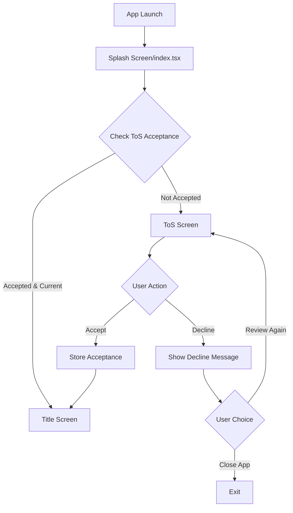

# Design Document

## Overview

The Terms of Service (ToS) acceptance feature implements a first-time user onboarding flow that presents legal terms before allowing access to the application. The design leverages Expo Router's navigation system, AsyncStorage for persistence, and React Native's native components for a smooth mobile experience.

The architecture follows a gating pattern where the ToS screen is strategically placed in the navigation flow to intercept first-time users. The implementation uses a version-based acceptance system allowing future updates to terms while maintaining a clean user experience for returning users.

**Referenced Requirements:** 1.1, 1.2, 1.3, 4.1, 5.1

## Architecture

### High-Level Flow



### Component Architecture

The implementation consists of:

1. **ToS Screen Component** (`app/terms-of-service.tsx`) - Main screen displaying terms with accept/decline UI
2. **ToS Content Component** (`constants/TermsOfServiceContent.ts`) - Versioned legal text
3. **ToS Storage Service** (`utils/tosStorage.ts`) - Persistence layer using AsyncStorage
4. **Navigation Guard Logic** (`app/index.tsx`) - Conditional routing based on ToS acceptance state

**Referenced Requirements:** 1.1, 1.2, 1.3, 1.4, 3.1

## Components and Interfaces

### 1. ToS Storage Service (`utils/tosStorage.ts`)

Manages persistent storage of ToS acceptance state using `@react-native-async-storage/async-storage` (already in dependencies).

```typescript
interface ToSAcceptance {
  version: string;
  acceptedAt: string; // ISO 8601 timestamp
  accepted: boolean;
}

// Storage key constant
const TOS_STORAGE_KEY = 'app_tos_acceptance';

// API
async function getToSAcceptance(): Promise<ToSAcceptance | null>
async function storeToSAcceptance(version: string): Promise<void>
async function hasAcceptedCurrentToS(currentVersion: string): Promise<boolean>
```

**Error Handling:**
- Returns `null` if no acceptance found or storage fails
- Logs errors but doesn't throw to prevent app blocking
- Corrupted data is treated as non-acceptance

**Referenced Requirements:** 4.1, 4.2, 4.3, 4.4, 7.2, 7.3

### 2. ToS Content (`constants/TermsOfServiceContent.ts`)

Centralizes ToS text and versioning.

```typescript
interface ToSContent {
  version: string;
  title: string;
  lastUpdated: string;
  sections: Array<{
    heading: string;
    content: string;
  }>;
}

export const CURRENT_TOS: ToSContent = {
  version: '1.0.0',
  title: 'Terms of Service',
  lastUpdated: 'January 2025',
  sections: [
    {
      heading: '1. Acceptance of Terms',
      content: 'By accessing and using this application...'
    },
    {
      heading: '2. Entertainment Purpose Only',
      content: 'This application is provided solely for entertainment purposes. All games, features, and activities are recreational in nature and involve NO real money, monetary value, or financial stakes...'
    },
    {
      heading: '3. Wallet Creation and Data Privacy',
      content: 'A cryptographic wallet is created locally on your device for the purpose of game functionality. No personal data is collected, stored, or transmitted to external servers...'
    },
    {
      heading: '4. User Conduct',
      content: 'Users agree to use the application lawfully and in accordance with these terms...'
    },
    {
      heading: '5. Limitation of Liability',
      content: 'The service is provided "as is" without warranties of any kind...'
    },
    {
      heading: '6. Intellectual Property',
      content: 'All content, trademarks, and intellectual property belong to the application provider...'
    },
    {
      heading: '7. Termination',
      content: 'We reserve the right to terminate or suspend access to the service at our discretion...'
    },
    {
      heading: '8. Changes to Terms',
      content: 'We may modify these terms at any time. Continued use after modifications constitutes acceptance...'
    },
    {
      heading: '9. Governing Law',
      content: 'These terms are governed by applicable laws...'
    }
  ]
};
```

**Design Rationale:** Centralizing content allows easy updates and ensures version consistency across the app. The section-based structure enables flexible rendering and future i18n support.

**Referenced Requirements:** 2.1, 2.2, 2.3, 2.4, 2.5, 2.6, 2.7

### 3. ToS Screen Component (`app/terms-of-service.tsx`)

Full-screen component for displaying and accepting ToS.

```typescript
// Component structure
export default function TermsOfServiceScreen() {
  const router = useRouter();
  const [scrolledToBottom, setScrolledToBottom] = useState(false);
  const [loading, setLoading] = useState(false);

  // Handlers
  const handleAccept = async () => {
    try {
      await storeToSAcceptance(CURRENT_TOS.version);
      router.replace('/title');
    } catch (error) {
      // Show error, prevent navigation
    }
  };

  const handleDecline = () => {
    // Show confirmation modal
  };

  return (
    <SafeAreaView>
      <ScrollView onScroll={handleScroll}>
        {/* ToS content */}
      </ScrollView>
      <View> {/* Button container */}
        <Button onPress={handleAccept}>Accept</Button>
        <Button onPress={handleDecline}>Decline</Button>
      </View>
    </SafeAreaView>
  );
}
```

**UI/UX Considerations:**
- Uses `ScrollView` with `onScroll` handler to track reading progress
- Optional: Disable "Accept" button until user scrolls near bottom (improves compliance)
- Fixed button bar at bottom (always accessible)
- Visual indicators for scroll position
- Loading state during acceptance storage
- Modal confirmation for decline action

**Styling:**
- Follows existing theme from `constants/Theme.ts`
- Black background (`#000000`)
- Primary orange (`#FF841C`) for accept button
- White text (`#FFFFFF`) for readability
- Pixelify Sans font for consistency
- Responsive spacing using theme values

**Referenced Requirements:** 1.4, 1.5, 3.1, 3.2, 6.1, 6.2, 6.3, 6.4

### 4. Navigation Guard (`app/index.tsx`)

Modified splash screen to check ToS acceptance and route accordingly.

```typescript
export default function SplashScreen() {
  const router = useRouter();
  const { aegisAccount } = useAegis();
  const [tosCheckComplete, setTosCheckComplete] = useState(false);

  useEffect(() => {
    const init = async () => {
      // Initialize account (existing logic)
      await initializeAccount();

      // Check ToS acceptance
      const hasAccepted = await hasAcceptedCurrentToS(CURRENT_TOS.version);
      setTosCheckComplete(true);

      // Route based on ToS state
      setTimeout(() => {
        if (!hasAccepted) {
          router.replace('/terms-of-service');
        } else {
          router.replace('/title');
        }
      }, 3000);
    };

    init();
  }, []);

  // Render splash screen
}
```

**Design Rationale:**
- Performs ToS check during splash screen to avoid visual glitches
- Uses `router.replace()` instead of `push()` to prevent back navigation to splash
- Maintains existing 3-second splash duration
- Account initialization happens in parallel with ToS check

**Referenced Requirements:** 1.1, 1.2, 1.3, 4.3, 4.4, 5.2, 5.3, 5.4

## Data Models

### ToS Acceptance State (AsyncStorage)

```typescript
// Stored at key: 'app_tos_acceptance'
{
  "version": "1.0.0",           // Matches CURRENT_TOS.version
  "acceptedAt": "2025-01-21T10:30:00.000Z",  // ISO 8601 timestamp
  "accepted": true              // Boolean flag
}
```

**Storage Strategy:**
- Single key for simplicity (`app_tos_acceptance`)
- JSON serialization for structure
- Timestamp allows future analytics or audit trails
- Version string enables upgrade detection

**Referenced Requirements:** 4.1, 4.2, 5.1, 5.2

### ToS Content Structure

See `ToSContent` interface in Components section above.

**Referenced Requirements:** 2.1, 2.2, 2.3, 2.4, 2.5, 2.6, 2.7, 5.1

## Screen Flow and Navigation

```mermaid
sequenceDiagram
    participant User
    participant Splash as Splash Screen (index.tsx)
    participant Storage as ToS Storage
    participant ToS as ToS Screen
    participant Title as Title Screen

    User->>Splash: App Launch
    Splash->>Splash: Initialize Account
    Splash->>Storage: Check ToS Acceptance
    Storage-->>Splash: Acceptance State

    alt ToS Not Accepted or Version Mismatch
        Splash->>ToS: Navigate to ToS
        ToS->>User: Display Terms
        User->>ToS: Scroll & Read
        User->>ToS: Click Accept
        ToS->>Storage: Store Acceptance
        Storage-->>ToS: Success
        ToS->>Title: Navigate to Title
    else ToS Already Accepted
        Splash->>Title: Navigate to Title
    end
```

**Navigation Details:**
- `router.replace()` used throughout to prevent back-stack issues
- ToS screen has no back button (intentional - forces decision)
- On decline, user can either review again or close app (no bypass)

**Referenced Requirements:** 1.1, 1.2, 1.3, 3.4, 3.5, 4.3, 4.4

## Error Handling

### Storage Failures

**Scenario:** AsyncStorage fails during acceptance save
- **Detection:** Try/catch in `storeToSAcceptance()`
- **Response:** Show error alert to user, remain on ToS screen
- **User Action:** Retry accept button or close app
- **Logging:** Console error with full stack trace

**Referenced Requirements:** 7.2

### Corrupted Data

**Scenario:** AsyncStorage contains invalid JSON or malformed acceptance object
- **Detection:** JSON.parse() exception or missing fields
- **Response:** Treat as non-acceptance, show ToS screen
- **Logging:** Log corruption details for debugging
- **Recovery:** User re-acceptance overwrites corrupted data

**Referenced Requirements:** 7.3

### Network/Initialization Failures

**Scenario:** App fails to load ToS content (unlikely since it's bundled)
- **Detection:** Missing CURRENT_TOS constant
- **Response:** Show generic error screen with retry option
- **Fallback:** Hardcoded minimal terms in error boundary

**Referenced Requirements:** 7.1

### Background/Foreground Handling

**Scenario:** User backgrounds app during ToS acceptance
- **Detection:** AppState listener (not required for MVP)
- **Response:** Maintain current state on foreground return
- **Data:** ScrollView position persists automatically
- **Navigation:** Remain on ToS screen

**Referenced Requirements:** 7.4, 7.5

## Version Management Strategy

### Updating Terms

When terms need updating:

1. Update `CURRENT_TOS.version` (e.g., `1.0.0` → `1.1.0`)
2. Modify relevant sections in `CURRENT_TOS.sections`
3. Update `lastUpdated` field
4. Deploy new app version

**Detection Flow:**
```typescript
// In hasAcceptedCurrentToS()
const stored = await getToSAcceptance();
if (!stored) return false;
if (stored.version !== currentVersion) return false; // Forces re-acceptance
return stored.accepted;
```

### User Experience for Updates

When user launches app after ToS version change:
1. Splash screen detects version mismatch
2. User routed to ToS screen
3. Screen shows "Updated Terms of Service" heading
4. User must re-read and accept new version

**Design Decision:** No diff view in MVP. Full re-acceptance ensures legal compliance.

**Referenced Requirements:** 5.1, 5.2, 5.3, 5.4, 5.5

## UI/UX Details

### Visual Design

**Layout:**
```
┌─────────────────────────────┐
│     Terms of Service        │  <- Fixed header
│        (Version 1.0)        │
├─────────────────────────────┤
│                             │
│   [Scrollable Content]      │  <- ScrollView
│   - Section headings        │
│   - Legal text              │
│   - Readable font size      │
│                             │
│         ↕ Scroll            │
│                             │
├─────────────────────────────┤
│  [Decline]    [Accept]      │  <- Fixed footer
└─────────────────────────────┘
```

**Typography:**
- Headings: 20px, bold, white
- Body: 16px, regular, white with 80% opacity
- Line height: 1.5 for readability
- Font: PixelifySans_400Regular (matches app theme)

**Colors:**
- Background: `Theme.colors.background` (#000000)
- Accept button: `Theme.colors.primary` (#FF841C)
- Decline button: White outline, transparent background
- Text: `Theme.colors.white` (#FFFFFF)

**Spacing:**
- Section gaps: `Theme.spacing.lg` (24px)
- Button padding: `Theme.spacing.md` (16px)
- Screen margins: `Theme.spacing.md` (16px)

**Referenced Requirements:** 6.1, 6.2, 6.4, 6.5

### Scroll Behavior

```typescript
const handleScroll = (event: NativeScrollEvent) => {
  const { layoutMeasurement, contentOffset, contentSize } = event.nativeEvent;
  const isCloseToBottom =
    layoutMeasurement.height + contentOffset.y >= contentSize.height - 50;
  setScrolledToBottom(isCloseToBottom);
};
```

**Scroll Indicator:**
- Fading gradient at bottom when not scrolled to end
- Removed when user reaches bottom
- Visual cue to encourage reading

**Referenced Requirements:** 6.3

### Decline Confirmation Modal

```typescript
// Modal shown when user taps Decline
<Modal>
  <Text>Terms of Service Required</Text>
  <Text>You must accept the Terms of Service to use this app.</Text>
  <Button onPress={reviewAgain}>Review Terms</Button>
  <Button onPress={closeApp}>Close App</Button>
</Modal>
```

**Referenced Requirements:** 3.5, 3.6, 3.7

## Testing Considerations

### Test Scenarios

1. **First-time user flow**
   - Launch app → See ToS → Accept → Reach title screen

2. **Returning user flow**
   - Launch app → Skip ToS → Reach title screen immediately

3. **Decline flow**
   - Launch app → See ToS → Decline → See modal → Review again

4. **Version upgrade flow**
   - Accept v1.0 → Update app with v1.1 → See ToS again

5. **Storage failure flow**
   - Accept → Storage fails → See error → Retry

6. **Scroll requirement flow**
   - View ToS → Scroll to bottom → Accept button becomes enabled

7. **Background/foreground flow**
   - View ToS → Background app → Foreground → Resume at same scroll position

**Referenced Requirements:** All

## Dependencies

### Existing Dependencies (No additions needed)
- `@react-native-async-storage/async-storage` (v2.2.0) - For ToS acceptance persistence
- `expo-router` (~6.0.11) - For navigation routing
- `react-native` (0.81.4) - Core UI components
- `react-native-safe-area-context` (~5.6.0) - For safe area handling

### New Files to Create
1. `app/terms-of-service.tsx` - Main ToS screen component
2. `utils/tosStorage.ts` - Storage service for ToS acceptance
3. `constants/TermsOfServiceContent.ts` - ToS text and versioning

### Modified Files
1. `app/index.tsx` - Add ToS check and conditional routing

**Referenced Requirements:** All applicable

## Performance Considerations

### Optimization Strategies

1. **ToS Content Loading**
   - Content is imported as constant (bundled at build time)
   - No runtime fetching required
   - Instant display on screen mount

2. **Storage Operations**
   - AsyncStorage reads/writes are async and non-blocking
   - Performed during splash screen (natural loading time)
   - Minimal UI impact

3. **Scroll Performance**
   - ScrollView with standard virtualization
   - Text content is static (no dynamic rendering)
   - Scroll handler debouncing not needed (simple boolean check)

4. **Memory Footprint**
   - ToS text ~5-10KB
   - Storage overhead negligible (<1KB)
   - No images or heavy assets

**Referenced Requirements:** 6.5

## Security Considerations

### Data Privacy

- **No personal data collected**: ToS acceptance timestamp is only local metadata
- **Secure storage not required**: Acceptance state is not sensitive (uses AsyncStorage, not SecureStore)
- **No network transmission**: All data stays on device

### Legal Protection

- **Clear disclaimers**: Entertainment-only and no-personal-data sections emphasized
- **Version tracking**: Audit trail of which version user accepted
- **Explicit consent**: Positive action (button tap) required for acceptance
- **No bypass**: Navigation structure prevents skipping ToS

**Referenced Requirements:** 2.2, 2.3, 4.1, 4.2

## Future Enhancements (Out of Scope for MVP)

1. **Multi-language support**: i18n for terms in multiple languages
2. **Diff view for updates**: Show only changed sections when terms update
3. **Privacy Policy separate screen**: Split ToS and Privacy Policy
4. **Analytics integration**: Track acceptance rates and drop-off points
5. **Accessibility improvements**: Screen reader optimizations, high contrast mode
6. **Export/email terms**: Allow users to save copy for their records

**Referenced Requirements:** N/A (future work)

---

## Summary

This design implements a robust, user-friendly ToS acceptance flow that:
- Gates first-time users effectively
- Stores acceptance state persistently with version tracking
- Provides smooth UX for returning users
- Handles errors gracefully
- Follows existing app architecture and styling
- Requires no new dependencies
- Supports future term updates

The implementation leverages Expo Router for navigation, AsyncStorage for persistence, and React Native's native components for optimal mobile performance. All requirements from the requirements document are addressed with clear traceability.
